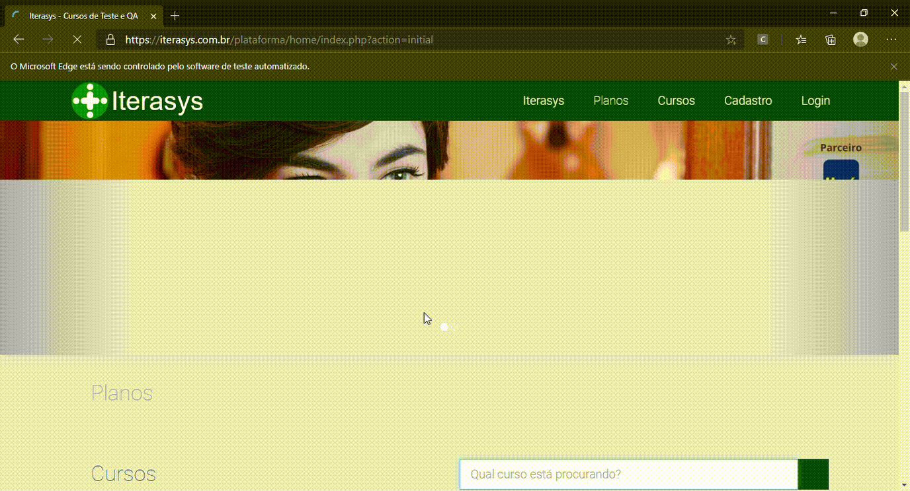

# automation-web-selenium
------------
### Tecnologias utilizadas:
- Selenium 
- JUnit

### Caso de teste
Busca de um curso  
Passo a passo:
- Acessar a página inicial do site;
- Inserir no campo busca o nome do curso;
- Clicar no botão de busca;
- Aparecer o resultado com o nome do curso buscado;
- Clicar em matricule-se.
#### Resultado esperado
- Ser encaminhado para a página de compra;
- Deve aparecer o curso com o nome; 
- Deve aparecer o curso com o valor. 

 
